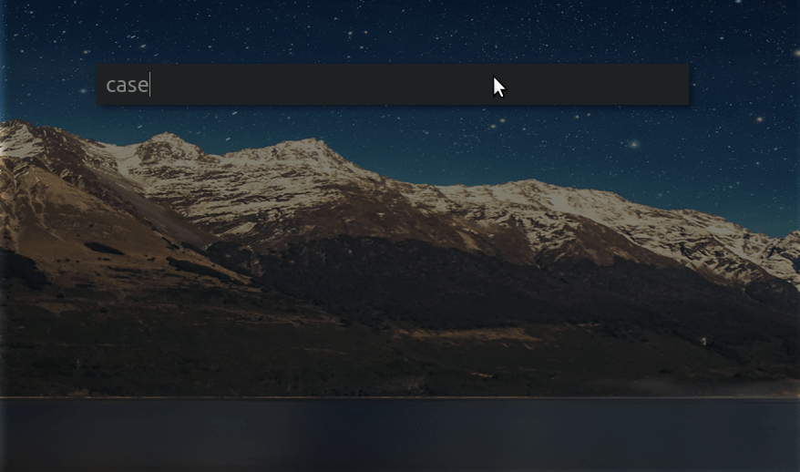

# cerebro-case-style

> [Cerebro](http://www.cerebroapp.com) plugin to convert to case style a text from 

> Note: it works only with Cerebro version >= 0.3.0

## Usage

In Cerebro, type `convert ` + your text or select the text from clipboard. Move with arrows and Tab keys to select the case style that you want. 
Once selected it will be added to the clipboard.

## Features

* Autocomplete from your clipboard.

## Related

- [Cerebro](http://github.com/KELiON/cerebro) – main repo for Cerebro app;

## License

MIT © [Marc Badia Cendros]
